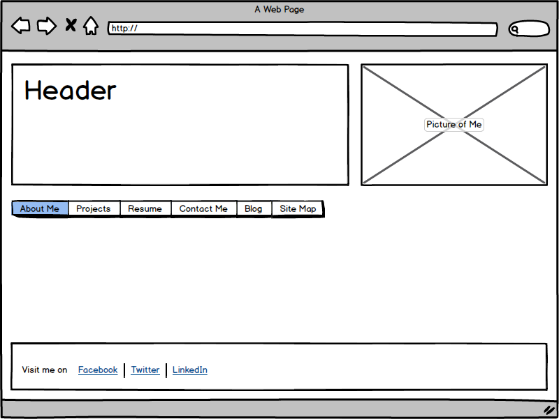

### What is a wireframe?

A wireframe is essentially a mockup design of a website. It can be sketched by hand or using wireframing software/web apps. Regardless of the method, it should be made clear in its use that it's not the finished product, and subject to change.

### What are the benefits of wireframing?

The benefits of wireframing are that you can go through the planning stages and determine the look of your site without having to go back and redo too much code.

### Did you enjoy wireframing your site?

I enjoyed doing the wireframing, although I found it a little difficult without having the knowledge to do any advanced design with html or CSS for the time being.

### Did you revise your wireframe or stick with your first idea?

I did revise both my design, and my method. I originally did my wireframe by hand on paper. I liked the freedom afforded by doing it with a marker, allowing me to choose every line. However, once I found wireframing software I liked, I started using that for ease of use, and most importantly, it allowed me to redo things if I had any changes. I definitely like to tinker with things until it's exactly what I envision.

### What questions did you ask during this challenge? What resources did you find to help you answer them?

I definitely had a lot of questions about whether I was choosing a good design for my site. I looked back over the UX resources provided and read a few other blogs, but ultimately, I didn't fret it too much because I guarantee the design will change as I learn CSS.

### Which parts of the challenge did you enjoy and which parts did you find tedious?

The wireframing did become a bit tedious like I said earlier, due to limitations of my own knowledge of html and CSS. There's only so much you can do on a site with basic html.