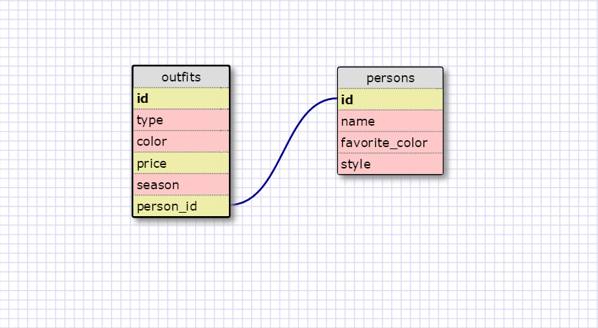

### SQL Queries:

1. SELECT * FROM states;
2. SELECT * FROM regions;
3. SELECT state_name, population FROM states;
4. SELECT state_name, population FROM states
   ORDER BY population DESC;	
5. SELECT state_name FROM states
   WHERE region_id = 7;
6. SELECT state_name, population_density FROM states
   WHERE population_density > 50
   ORDER BY population_density ASC;
7. SELECT state_name FROM states
   WHERE population BETWEEN 1000000 AND 1500000;
8. SELECT state_name, region_id FROM states
   ORDER BY region_id ASC;
9. SELECT region_name FROM regions
   WHERE region_name LIKE '%Central%';
10.SELECT region_name, state_name FROM regions
   JOIN states ON
   states.region_id = regions.id;

   

### What are databases for?

Databases are for organizing large sets of information.

### What is a one-to-many relationship?

A one-to-many relationship represents the connection between one set of information and multiple others. For instance, a football team represents a one-to-many relationship because a team will have many players, but that player can be assumed to only play for one team.

### What is a primary key? What is a foreign key? How can you determine which is which?

A primary key is a unique identifier that each set of data has exactly one of. A foreign key is one that connects one data set to another, corresponding to the primary key of whatever other data set it's related to. A primary key will usually be named simply 'id', whereas a foreign key references the data set it's linking to by name. For instance in the state/region example, the primary key would be the 'id' field under regions, and the foreign key would be the 'region_id' field under states.

### How can you select information out of a SQL database? What are some general guidelines for that?

Selecting information out of a SQL database is as easy as using the SELECT and FROM keywords. 